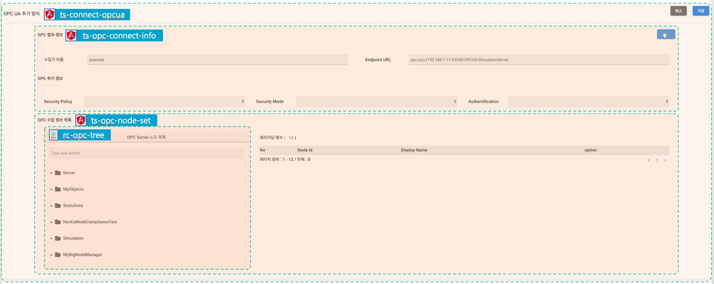

OPC/UA 데이터 연결 설정 페이지
---

Components
---

|    | Name                       | Framework | Source                                  | description        |
|----|----------------------------|-----------|-----------------------------------------|--------------------|
| 1. | ts-connect-opcua           | AngularJs | ./index.(html, ts)                      | Main               |
| 2. | ts-opc-connect-info        | AngularJs | ./connectInfo.(html, ts)                | 입력 전용            |
| 3. | ts-opc-node-set            | AngularJs | ./nodeset.(html, ts)                    | OPC/UA 수집 정보 설정 |
| 4. | rc-opc-tree                | React     | /public/app-thingspin-fms               | OPC/UA 노드 조회     |
|    |                            |           | /react/components/OpcNodeTree/index.tsx |                    |

use open source Libraries
---

1. AngularJs
2. shortId(https://www.npmjs.com/package/shortid)
3. Lodash(https://www.npmjs.com/package/lodash)
